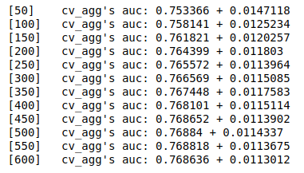
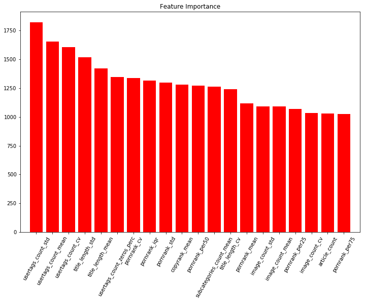
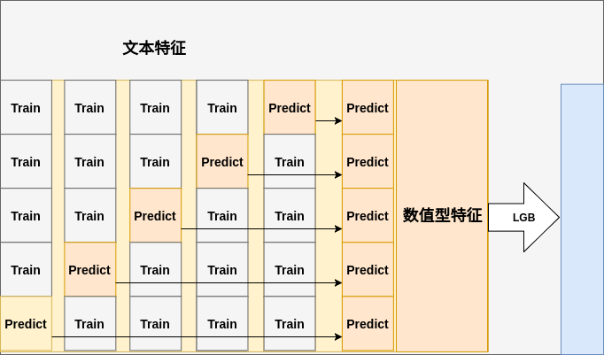

# AuthorScore

## 1. 问题描述
- 数据源：
    - 小米浏览器
    - 想看
- 数据内容：
    - browser.feeds_content_source_authority
    - profile.o2o_browser_log_info
    - profile.o2o_browser_noenter_info
    - feeds.browser_news_batch_idx
    - feeds.browser_video_batch_idx
    - ~~feeds.browser_atlas_batch_idx~~
    - ~~feeds.content_operations~~

- 二分类问题：根据资讯及其用户行为预测其作者好用坏，节约运营成本
    - 好坏样本比：2949/24334 = 1/8.3
- 评估指标：
    - 线下：AUC
    - 线上：人工标注好样本转化率
---

## 2. 特征工程
- 用户特征群：用户表征资讯
    - expose
    - click
    - view
    - like
    - unlike
    - collection
    - share
    - duration
- 资讯特征群：资讯表征作者
    - 用户特征群的统计特征
        - mean        
        - min               
        - max
        - ...
    - tags
    - quality
    - pornrank
    - copyrank
    - bodylen
    - length(title)
    - size(images)
    - size(usertags)
    - size(category)
    - size(subcategories)

- 作者特征群：
    - 资讯特征群的统计特征
        - ...
    - 作者名及资讯标签文本特征
        - ngrams 
        - tfidf
        - embedding：待续
---
## 3. 模型设计
> 线下评估：5折 cv AUC

词|含该词样本数|好样本占比
---|---|---
版权	|118|0.762712
京报	|16	|0.750000
合作	|122|0.745902
央视	|23	|0.739130
青年报	|16	|0.687500
人民网	|33	|0.636364
新华	|32	|0.593750
凤凰网	|72	|0.569444
卫视	|65	|0.569231
腾讯	|219|0.561644
版	    |205|0.560976
客户端	|24	|0.541667
视网	|17	|0.529412

- 仅用作者名文本特征 models
    - 分词 + tfidf + lr：线下 auc 0.6877
    - 分词 + 去停用词 + tfidf + lr：线下 auc 0.7077
    - 字 + tfidf + lr：线下 auc 0.7185

---
- 仅用资讯标签文本拼接特征 models
    - 标签词 + tfidf + lr：线下 auc 0.7057

---
- 仅用数值型特征 models
    - lgb：线下 auc 0.769
    - xgb: 待续
   

   

- 最终模型：线下 auc 0.8276

